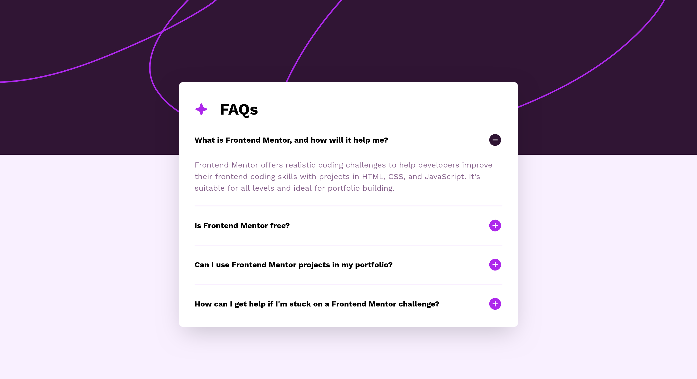

# Frontend Mentor - FAQ accordion solution

This is a solution to the [FAQ accordion challenge on Frontend Mentor](https://www.frontendmentor.io/challenges/faq-accordion-wyfFdeBwBz). Frontend Mentor challenges help you improve your coding skills by building realistic projects.

## Table of contents

- [Overview](#overview)
  - [The challenge](#the-challenge)
  - [Screenshot](#screenshot)
  - [Links](#links)
- [My process](#my-process)
  - [Built with](#built-with)
  - [What I learned](#what-i-learned)
  - [Continued development](#continued-development)
  - [Useful resources](#useful-resources)

## Overview

### The challenge

Users should be able to:

- Hide/Show the answer to a question when the question is clicked
- Navigate the questions and hide/show answers using keyboard navigation alone
- View the optimal layout for the interface depending on their device's screen size
- See hover and focus states for all interactive elements on the page

### Screenshot

### Links

- Solution URL: [FAQ Accordion](https://www.frontendmentor.io/solutions/responsive-and-accessible-faq-accordion-using-htmlscss-w-and-wo-js-6Xql01OHpb)
- Live Site URL: [FAQ Accordion](https://fem-faq-accordian-vert.vercel.app/)

## My process

### Built with

- Semantic HTML5 markup
- CSS custom properties
- Flexbox
- Mobile-first workflow
- [Vite](https://vite.dev/guide/) - Build tool

### What I learned

- Learned about making a accessible accordion.
- Use of aria-\* attributes.
- Polish my skills in HTML/CSS by making the accordion purely by it.

### Continued development

- Making the project again with a framework and styling libraries.
- Optimizing the current code with HTML/CSS.

### Useful resources

- [Aditus-Accessible Accordion](https://www.aditus.io/patterns/accordion/) - This helped me becoming a one stop solution to finding an article that explained me how to build an accessible accordion from scratch.
